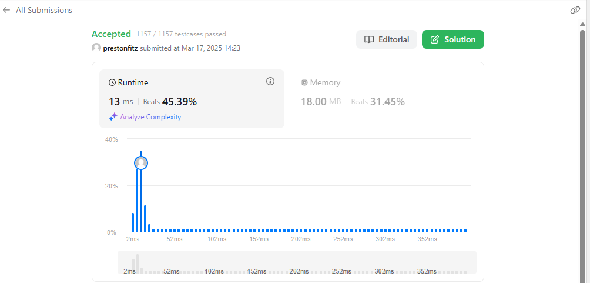

This was a fun problem to visualize and may be one of the more fun problems that I did. To visualize this, I imagined a bouncing ball. It starts by going down, it hits a point, goes up, hits a point (or "hits" a point if you have no ceiling), and then goes back down. So, I did the same thing with the row numbers. I had an index that started at a point (1), went down (or in our case, actually up. Keep up with the visual metaphor😊) until it hit the row number. I then reversed the direction for the index. I kept up this pattern until I ended the string. I stored the values in a dictionary, though this could have been done with arrays as well. Either works quite efficiently.
