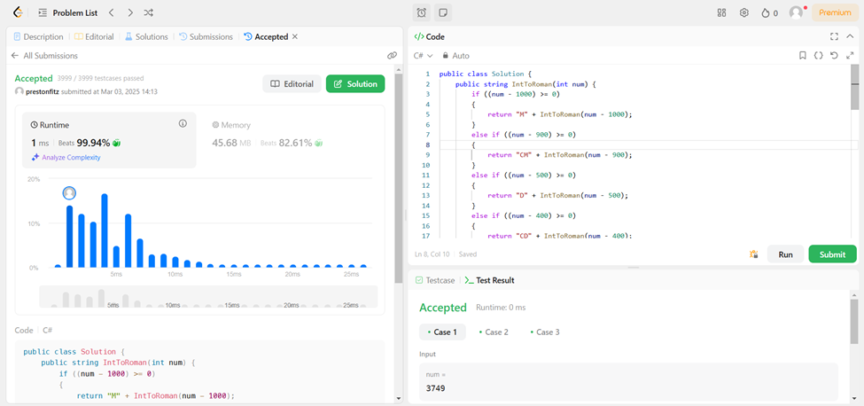

I have done this one a few times, but after learning about recursion, I had the thought that this one would lend itself quite well to recursion, and it does. Rather than using while loops (which is how I did it the first time), I can simplify the code to an if statement. Each condition would being with a character and then call the function again to append the next character on the list. The base case is when the passed integer equals 0. This demonstrates a top-down approach where we actually start by finishing the right end of the numeral before we finish calculating the left end.
