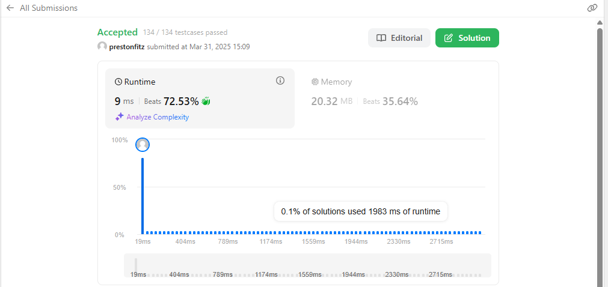

Heaps are cool because they sort themselves so that either the largest or smallest value is always on top (depends on the type heap that you set up). They are also nice because it does not matter what values are underneath; it will always sort itself. We take advantage of that here so that we do not need to spit the entirety of each linked list out. Instead, whenever we add a value to our result list, we simply remove it from the heap and then add it's next value to the heap. The heap sorts itself and then is ready to add the next value. Thus, we are able to sort all k lists without ever having to be able to see all k nodes at once.
