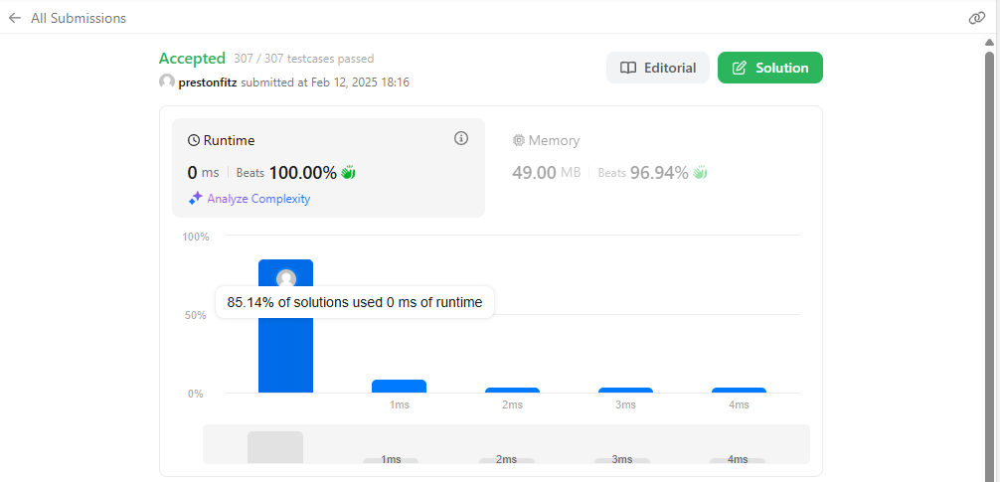

This may seem to be a weird one, and it kind of is. All I did was use the base functionality that does this. Quick, simple, efficient. How would I defend this in an interview? When we talked about hash functions, you mentioned that most languages already have an efficient way to do some of those functions and that we often have no need to reinvent the wheel. This is the case here. I already have something that does this, and it is quite efficient. I still don’t know why it there are no restrictions to just doing this on the problem.
