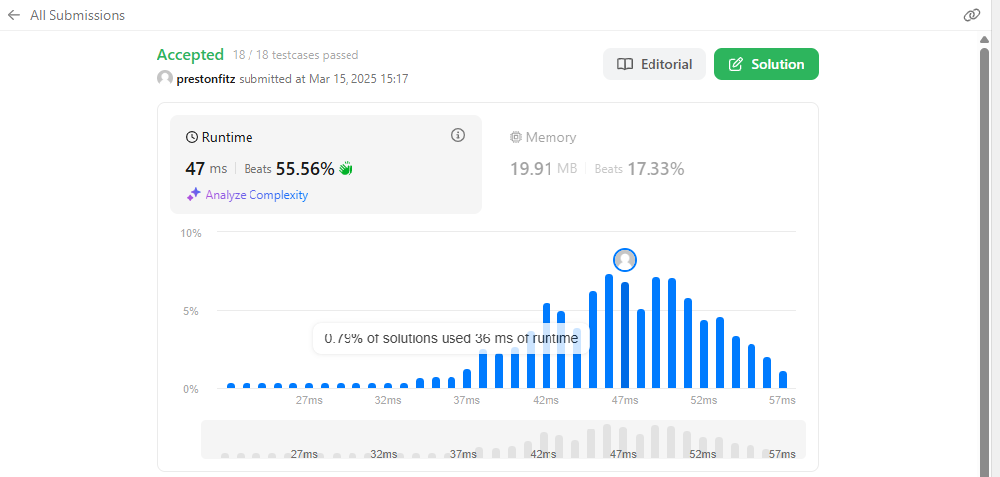

First is that we are using a linked list and traversing it by transitioning to each next node. The second is the use of the dictionary. Objects themselves can be hashed, which allows for quick lookup and insert to track if we have seen a node before. Thus, this function does not exceed O(N), because the look up in the dictionary is constant. We only have to worry about iterating over the length of the list.
