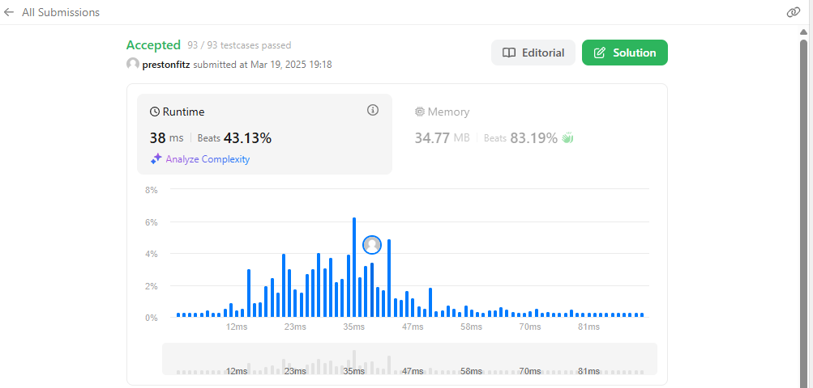

# [Palindrome Linked List](https://leetcode.com/problems/palindrome-linked-list/)

This problem was solved using an approach similar to the tortoise and the hare. I iterated over the list essentially twice at the same time, with one pointer moving at twice the speed of the other. This allowed me to find the mid point. I then reversed the second half and compared it to the first.

To see a more detailed explaination, please check out my [tutorial](https://github.com/prestonfitz/palindrome-linked-list-tutorial) on this problem.
