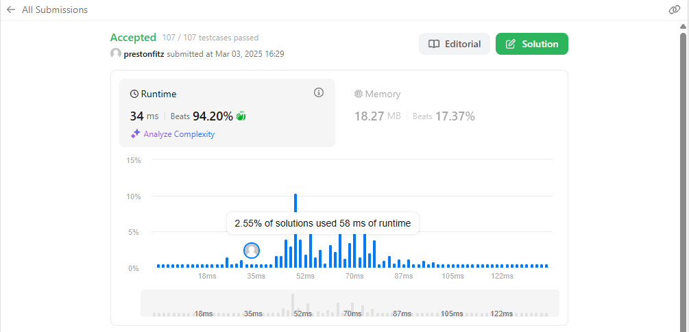

This is another problem that I attacked recursively, though I ended up doing it in two functions, so it is probably not the cleanest solution. The focus here is on the subset function. The subset function takes a string and begins by counting the occurrences of the first character. If there is more than one instance of that character, it removes all of those characters from the string and calls itself again on that string. It does that until it finds a character with only one instance or it removes all characters from the string. The main function then finishes by searching for the index of that string or returning -1. Before I can speak for the full big O of the equation, I would need to know more about the python replace function. But, assuming that the replace function acts linearly, then this is a linear function, because the most pathological case will only be able to iterate over the function 26 times. Because that is constant, and constants are ignored, this would be O(N).
